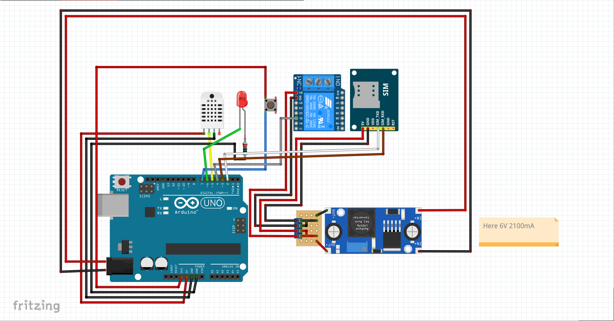

# Mountain House Boiler Control With SIM

This project is used to control the boiler of the mountain house using a sim (being absent of wired connection)

## Components

- [x] Arduino UNO

- [x] DHT22

- [x] Relay5V Module

- [x] GPRS SIM800 Module 

- [x] Button

- [x] Led Status RED

- [+-] 3D Printed Case (take measure of sensors [when arrived])

- [x] 6V 2100mA PowerSupply (find at Home)

- [x] StepDown for low Voltage

- [x] Mammut

- [x] Cables

- [x] Sim ThingsMobile

- [] Android Application

## Requests

### Client Application (ANDROID)

Through this app it is possible to manage the structure of the message to be sent to arduino for boiler management (works in progress)

### Arduino Software

Adjust the temperature with SMS as Input and turn off when [OR]:

1. Receive an SMS with OFF

2. Receive an SMS with DATE of TURNOFF

3. Click Button for TurnOFF 

### Power

Since the GSM card needs 5V 2A peak, I power the following devices as follows:

- 6V 2100mA
  
  - Arduino
    
    - Led
    - Button
    - DHT22
  
  - StepDown to 5V (max current support 2A)
    
    - GPRS SIM800 Module
    - Relay5V Module

## 3D Case

Into `case` folder we can find all files of 3D case (Fusion360 files and STL for printing)

## Wiring

The wiring scheme can you find into `wiring` folder (Fritzing)

